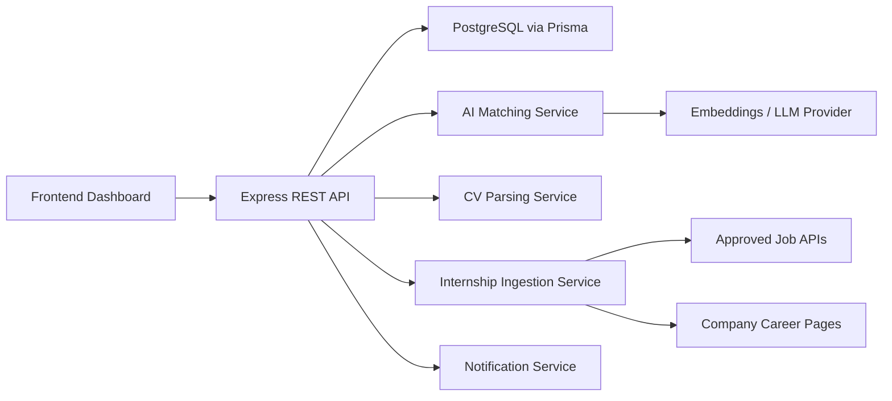
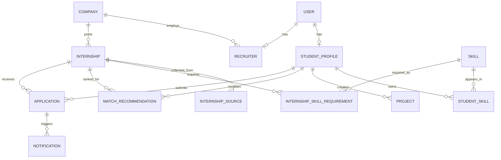
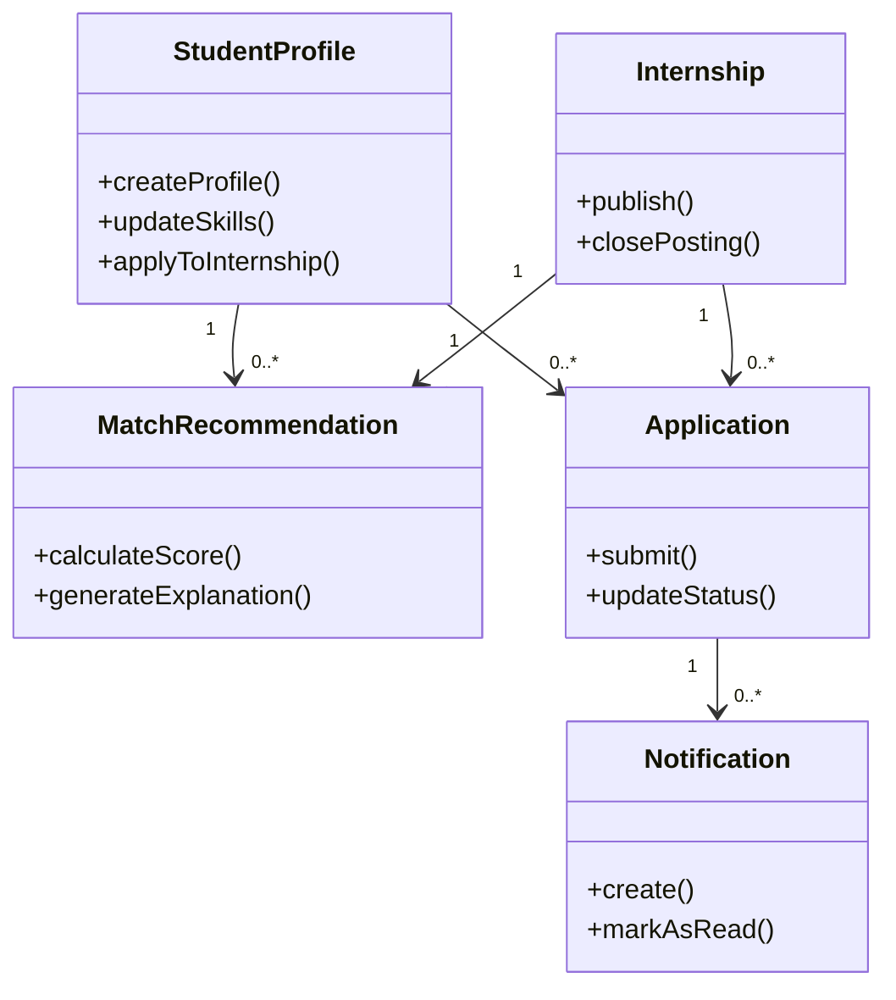
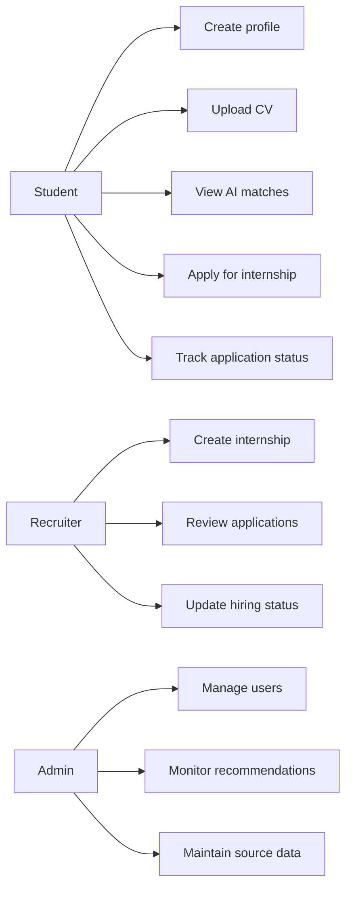
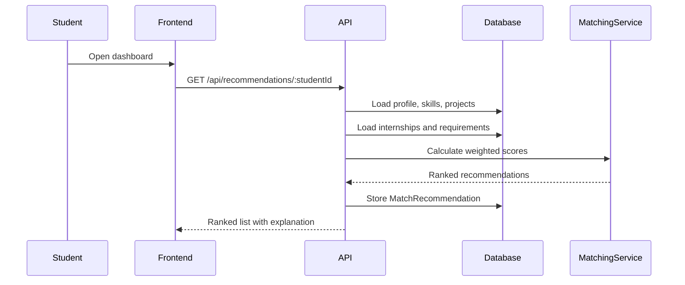
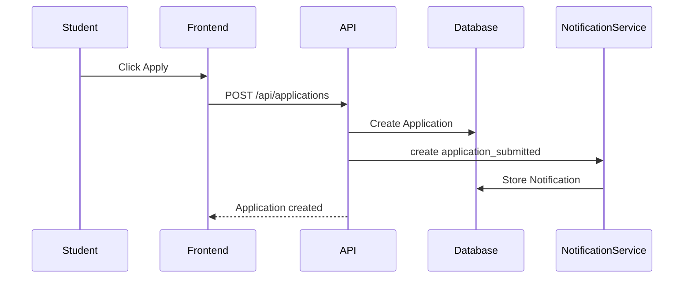
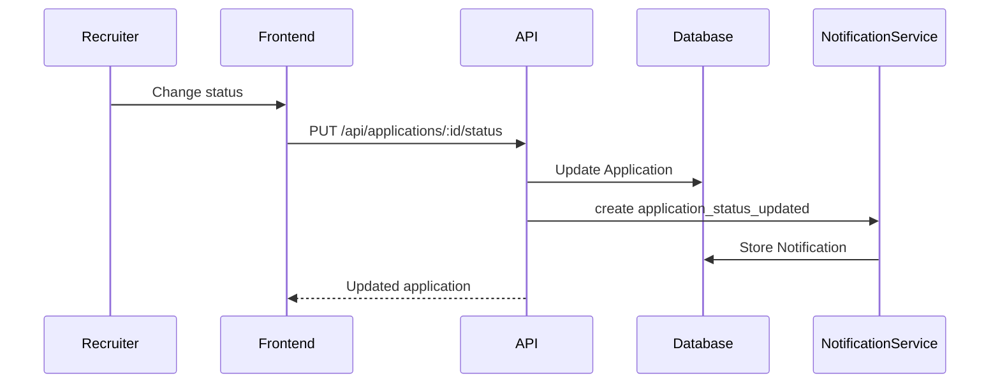
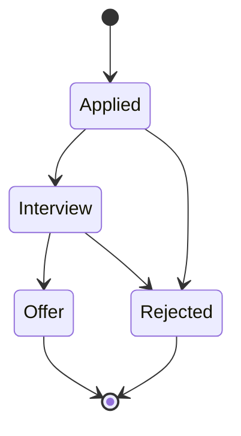

# Architecture Report

## System Overview

The FHNW AI Internship Matching Platform is structured as a SaaS application with a browser dashboard, Express API, PostgreSQL database, and service modules for matching, CV parsing, notifications, and internship ingestion.



## ER Diagram



## UML Class Diagram



## Use Cases



## Sequence: Recommendation Flow



## Sequence: Application Flow



## Sequence: Status Update Flow



## Application State Diagram



## Matching Formula

```txt
match_score =
  skills_score * 0.50 +
  project_relevance_score * 0.25 +
  preference_score * 0.15 +
  availability_score * 0.10
```
