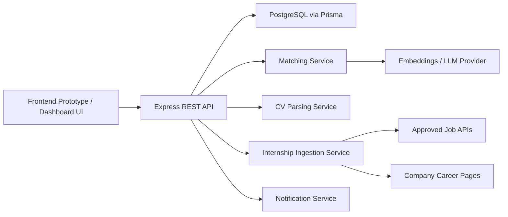
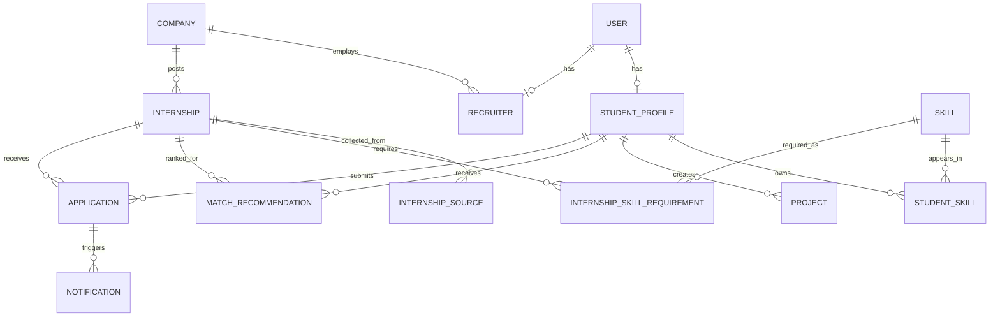
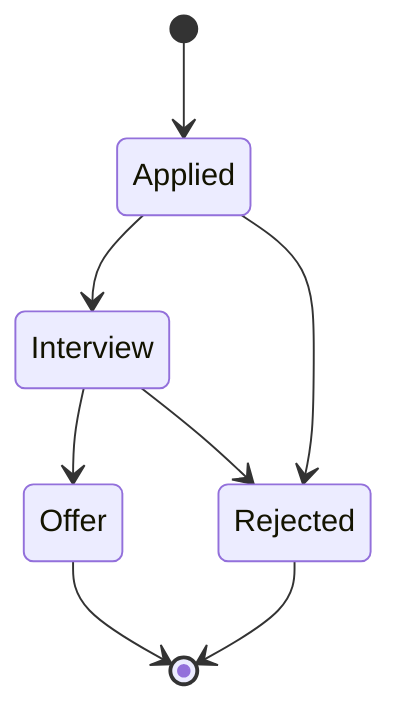
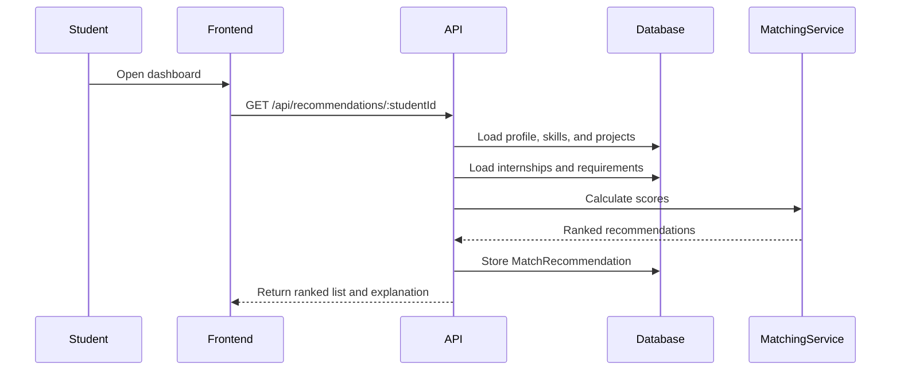
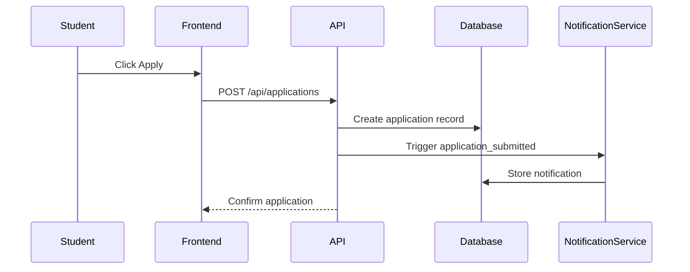
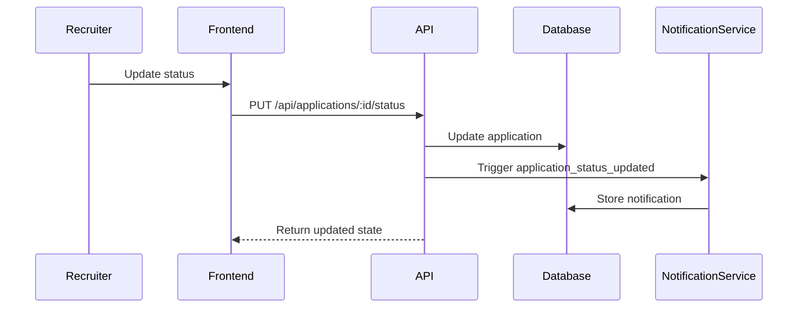

# Lycan AI Internship Matching Platform

This project is intended to:

- design and present a full internship matching platform for FHNW students
- evolve a static frontend prototype into a production-ready SaaS MVP
- demonstrate clean separation between frontend, backend, data, and AI-oriented services
- model real internship discovery workflows for students, recruiters, and administrators
- provide academic-quality documentation suitable for FHNW coursework and presentations
- serve as a portfolio-ready software engineering project

## Project Description

Lycan AI Internship Matching Platform is an internship discovery and application management system designed for FHNW students. The platform brings together student profiles, recruiter workflows, internship listings, application tracking, and AI-supported recommendations in one structured product.

The current project already includes an interactive frontend prototype with a student dashboard, recruiter review workflow, admin analytics, notifications, and simulated AI matching logic. A backend scaffold has also been prepared using Express, PostgreSQL, and Prisma so the prototype can be upgraded into a real SaaS MVP with authentication, database persistence, CV upload, and API-driven data flows.

The long-term goal is to support internship discovery from approved external sources, normalize and store listings, deduplicate overlapping records, rank opportunities for students using matching logic, and explain recommendations in a transparent and presentation-ready way.

## Application Requirements

### Problem

Students often search for internships across many different websites, track applications manually, and receive very little guidance about why a role fits their profile or which skills they still need to improve. Recruiters also spend time reviewing large pools of candidates without a clear ranking workflow. This leads to fragmented discovery, duplicated effort, and weak visibility across the application lifecycle.

### Scenario

Lycan AI Internship Matching Platform acts as a central workspace for internship discovery and application management. Students create a structured profile, review ranked internships, understand AI-generated match reasoning, and track all applications in one place. Recruiters manage postings, review candidates, inspect CV information, and move applicants through a hiring pipeline. Admin users monitor platform activity, source freshness, and analytics across the system.

### User Stories

- As a student, I want to create a profile with my skills, preferences, and availability so that I can receive relevant internship recommendations.
- As a student, I want to view ranked internship matches so that I can focus on the opportunities most aligned with my background.
- As a student, I want to see why an internship was recommended so that I can understand the match score and improve weak areas.
- As a student, I want to track applications and status updates so that I can manage my internship search in one workflow.
- As a recruiter, I want to create and manage internship postings so that I can publish role requirements clearly.
- As a recruiter, I want to review matched candidates and CV summaries so that I can identify strong applicants more efficiently.
- As a recruiter, I want to update hiring status so that the student and platform stay synchronized.
- As an admin, I want to monitor users, internships, applications, and source activity so that platform operations remain visible and maintainable.

## Core Product Modules

### Student Workspace

- profile editor for FHNW student information
- skills, interests, languages, and availability fields
- AI-ranked top internship matches
- match explanations and skill-gap insights
- application tracker with status updates
- notifications panel

### Recruiter Workspace

- recruiter dashboard with candidate review
- internship posting workflow
- application review and status controls
- CV review support
- hiring pipeline / kanban workflow

### Admin Workspace

- platform statistics overview
- source distribution and freshness monitoring
- analytics and activity summaries
- operational visibility for internship and application data

### Backend Upgrade Path

- REST API with Express
- PostgreSQL persistence via Prisma ORM
- JWT-based authentication
- CV upload and parsing endpoints
- recommendation service and notification service
- internship ingestion architecture for approved sources

## Architecture

The platform follows a layered SaaS-oriented structure:

1. Presentation Layer
   - interactive frontend prototype in HTML, CSS, and Vanilla JavaScript
   - public landing experience plus student, recruiter, and admin dashboard views

2. API / Application Layer
   - Express-based backend scaffold
   - route modules for auth, students, recruiters, companies, internships, recommendations, applications, notifications, CV, and admin analytics

3. Service Layer
   - matching service
   - notification service
   - CV parsing service
   - internship ingestion service
   - search / provider abstraction

4. Persistence Layer
   - PostgreSQL as target production database
   - Prisma schema and seed files

## System Overview



## Database and ORM

The backend is prepared for a relational database design using PostgreSQL and Prisma ORM.

### Main Models

- `User`
- `StudentProfile`
- `Recruiter`
- `Company`
- `Internship`
- `InternshipSource`
- `Skill`
- `StudentSkill`
- `Project`
- `InternshipSkillRequirement`
- `MatchRecommendation`
- `Application`
- `Notification`
- `CVDocument`
- `AdminAnalytics`

### Key Relationships

- one user can represent a student, recruiter, or admin role
- one student profile belongs to one user
- one recruiter belongs to one company
- one company can post many internships
- one student can have many skills and projects
- one internship can require many skills
- one student can receive many recommendations
- one student can submit many applications
- one application can trigger notifications

### ER Diagram



## Matching Logic

The current prototype uses simulated weighted matching. The backend is structured so that rule-based scoring can later be combined with embeddings and LLM explanations.

### Current Weighting Model

- skills: 50%
- experience / project relevance: 25%
- preferences / industry / location: 15%
- availability: 10%

### Target Outputs

- match score
- ranked internship list
- explanation for "Why this match?"
- skill-gap analysis
- learning recommendations

```txt
match_score =
  skills_score * 0.50 +
  project_relevance_score * 0.25 +
  preference_score * 0.15 +
  availability_score * 0.10
```

## Application Lifecycle

The application workflow currently supports a practical hiring pipeline:

- Applied
- Interview
- Offer
- Rejected

Valid transitions:

- Applied -> Interview
- Applied -> Rejected
- Interview -> Offer
- Interview -> Rejected



## Current Features Already Implemented

### Frontend Prototype

- public landing page
- login and register demo flows
- student dashboard
- profile editing
- internship discovery and match cards
- recruiter dashboard and application review
- admin dashboard and analytics panels
- local notifications workflow
- localStorage persistence

### Backend Scaffold

- Express app structure
- Prisma schema
- API route modules
- service modules for matching, CV parsing, ingestion, notifications, and search
- environment configuration example
- seed-ready database structure

## API Design

The backend is structured around REST endpoints.

### Auth

- `POST /api/auth/register`
- `POST /api/auth/login`
- `GET /api/auth/me`

### Students

- `GET /api/students`
- `GET /api/students/:id`
- `POST /api/students`
- `PUT /api/students/:id`

### Recruiters

- `GET /api/recruiters`
- `GET /api/recruiters/:id`
- `POST /api/recruiters`
- `PUT /api/recruiters/:id`

### Companies

- `GET /api/companies`
- `POST /api/companies`
- `PUT /api/companies/:id`

### Internships

- `GET /api/internships`
- `GET /api/internships/:id`
- `POST /api/internships`
- `PUT /api/internships/:id`

### Applications

- `POST /api/applications`
- `GET /api/applications/student/:id`
- `PUT /api/applications/:id/status`

### Notifications

- `GET /api/notifications`
- `GET /api/notifications/:userId`
- `PUT /api/notifications/:id/read`

### Recommendations

- `GET /api/recommendations/:studentId`

### CV

- `POST /api/cv/upload`
- `POST /api/cv/parse`

### Admin

- `GET /api/admin/stats`
- `GET /api/admin/sources`
- `GET /api/admin/analytics`

## Sequence Diagrams

### Recommendation Flow



### Application Submission Flow



### Recruiter Status Update Flow



## Repository Structure

```txt
2026-04-21-ai-internship-matching-platform-fhnw-version/
├─ README.md
├─ index.html
├─ .gitignore
├─ frontend/
│  ├─ index.html
│  ├─ styles.css
│  ├─ app.js
│  ├─ apiClient.js
│  ├─ nicegui_app.py
│  └─ from nicegui import ui.py
├─ backend/
│  ├─ .env.example
│  ├─ README.md
│  ├─ ARCHITECTURE.md
│  ├─ package.json
│  ├─ prisma/
│  │  ├─ schema.prisma
│  │  └─ seed.js
│  └─ src/
│     ├─ server.js
│     ├─ config.js
│     ├─ db.js
│     ├─ middleware/
│     ├─ routes/
│     └─ services/
└─ docs/
   └─ FRONTEND_API_MIGRATION.md
```

## Setup

### Frontend Prototype

Open the frontend entry file directly, or run the local demo server already used during development.

- root redirect page: [index.html](/Users/lycan/Documents/Codex/2026-04-21-ai-internship-matching-platform-fhnw-version/index.html)
- main frontend page: [frontend/index.html](/Users/lycan/Documents/Codex/2026-04-21-ai-internship-matching-platform-fhnw-version/frontend/index.html)

### Backend Setup

```bash
cd backend
cp .env.example .env
npm install
npm run prisma:generate
npm run prisma:migrate
npm run seed
npm run dev
```

Default backend URL:

- `http://localhost:4000`

## Recommended Environment Variables

- `DATABASE_URL`
- `JWT_SECRET`
- `OPENAI_API_KEY`
- `MATCHING_PROVIDER`
- `EXPLANATION_PROVIDER`
- `SEARCH_PROVIDER`
- `GOOGLE_API_KEY`
- `GOOGLE_CSE_ID`

These should stay in backend configuration only and should not be exposed in frontend code.

## Migration Path

The current UI still uses `localStorage` for prototype persistence. The intended migration path is:

1. replace local internship loading with API-based internship retrieval
2. replace local application saving with backend application creation
3. connect notifications to backend state
4. connect recruiter status updates to the API
5. replace simulated recommendation logic with backend-generated recommendations
6. add authentication and protected user sessions

## Academic / Presentation Value

This project is suitable for:

- FHNW Business IT presentations
- software engineering coursework
- architecture and UML documentation exercises
- SaaS MVP portfolio demonstrations

It already demonstrates:

- user-role-based product design
- layered software architecture
- relational data modeling
- workflow-driven dashboard design
- AI integration planning
- incremental migration from prototype to production

## Next Steps

- connect frontend state to the backend API
- add real authentication and protected routes
- enable PostgreSQL persistence
- implement CV upload storage and parsing
- connect approved internship ingestion sources
- upgrade match explanations with real AI providers
- add automated tests and deployment configuration
